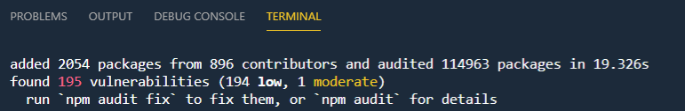

# Using Node as a Dev Tool

Installation

```
npm i -g webpack webpack-cli gulp gulp-cli
```

[npm CLI Documentation](https://docs.npmjs.com/cli-documentation/)

[npm audit](https://docs.npmjs.com/cli/audit.html)



## Execute Sample Tasks

Run a gulp task: 

```
gulp babel
gulp compile-sass
```
Run webpack: 

```
webpack
```
> Note: Uses `webpack.config.js` by default


# Links & Ressources

[Node.js](https://nodejs.org)

[NVM for Windows](https://github.com/coreybutler/nvm-windows)

[Typescript](https://www.typescriptlang.org/)

[Webpack](https://webpack.js.org/)

[Gulp](https://gulpjs.com/)

[Yeoman](https://yeoman.io/)